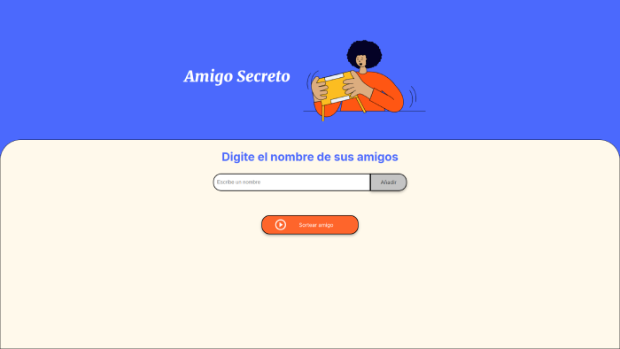
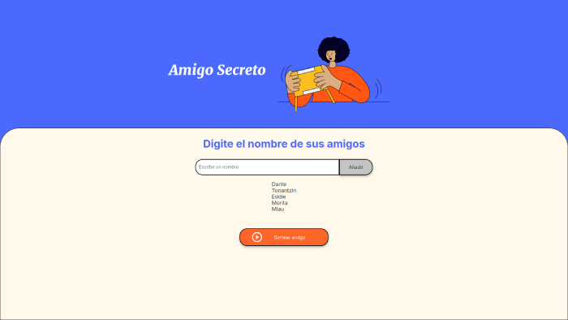
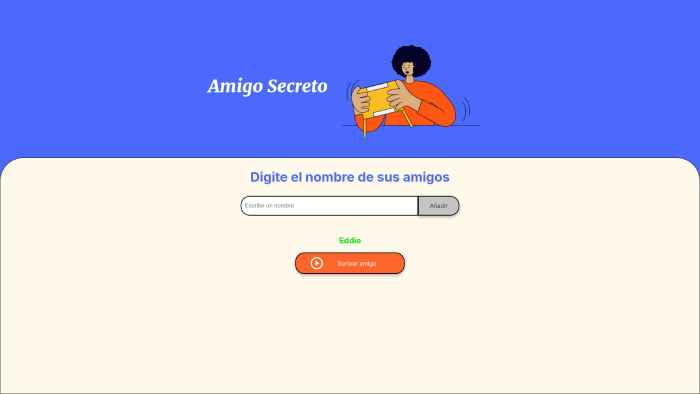

# Alura Challenge Amigo Secreto

Desafio de codigo para medir las habilidades y conocimietos basicos como programador en JavaScript de los candidatos a los cursos de Backend con Java e Inteligencia artificial con Python.

## Demo

https://spinosaurusdev.github.io/challenge_amigo_secreto_main/

## Functionalities

Se ha implementado codigo de JavaScript para manipular los diferentes elementos de la pagina. Inicialmente se implementa un array para guardar el listado de nombres.

Posteriormente se implementaron las funciones de limpieza del imput de los nombres y del array de almacenamiento.

Luego se creo la funcion agregarAmigo() que comprueba si el input esta vacio o si el nombre ya se agrego, incluyendo reconocimiento de mayusculas y minusculas.

Tambien se crea la funcion listingFriends() para agregar el listado en pantalla en una lista desordenada.

Por ultimo se creo la funcion sortearAmigo() agregando la comprobacion de lista existente y borrado de la lista despues de selccionar 1 amigo.

## Screenshots

## Authors

- [@spinosaurusdev](https://github.com/spinosaurusdev)

## Lessons Learned

Este challenge me permitio practicar como intervenir el DOM con scripts de JS, algo que en la teoria ya deberia saber pero en la practica no estaba bien reforzado. Ahora tengo mas claro el alcance de mi conocimiento y voy a dedicarme a mejorarlo y ampliarlo.
